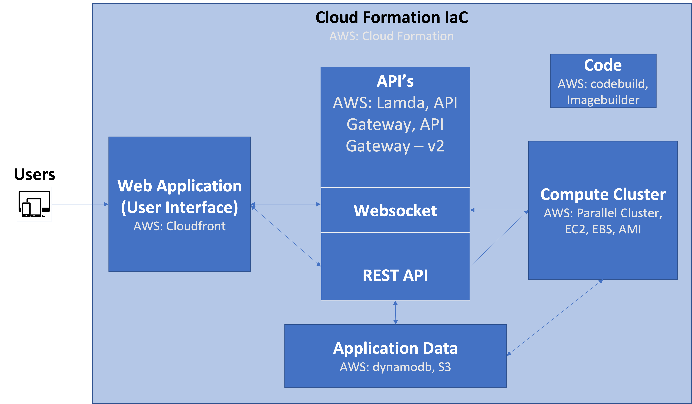

.. _overview:

*********************
Overview of WRF Cloud 
*********************

The WRF Cloud framework is a cloud-based forecasting system that was designed to easily facilitate cost-effective state-of-the-art numerical weather prediction system forecasts in communities that lack the large computational resources. 

Purpose and organization of the User's Guide
============================================

The goal of this User's Guide is to document the procedures required to install the WRF Cloud framework and to serve as a reference for using and adapting the system to an organization's own needs. As features are added to the framework, this User's Guide will continue to be expanded to document new capabilities. 

The User Guide is organized by first providing an overview of the system, followed steps to install the framework and adminstartion details to manage the system. Finally the user interface is documented along with details about the graphical outputs produced by the system. 

UCAR/UCP/COMET and UCAR/NCAR/RAL
================================

This project is made possible by `UCAR <https://www.ucar.edu/>`_/`UCP <https://www.ucar.edu/community-programs>`_/`COMET <https://www.comet.ucar.edu/>`_ and collaborations with `UCAR <https://www.ucar.edu/>`_/`NCAR <https://ncar.ucar.edu/>`_/`RAL <https://ral.ucar.edu/>`_/`MMM <https://www.mmm.ucar.edu/>`_.  

.. _wrfcloud-goals:

WRF Cloud goals and design philosophy
=====================================

The primary goal of this projec is to provide easy access to powerful NWP forecasts to communities lacking financial or computation resources to maintain baremetal forecasting platforms. The aim for this framework is to be:

* Flexibility and customizable
* Efficeint and cost-effective
* Easy to setup, use, and manage
* Useful and accessible

WRF Cloud components
====================

The WRF Cloud framework primarily consists of a web application and a python package that were developed to orchestrate all of the necessary components of the end-to-end system from the web application to the user authentication and authorization, as well as the numerical weather software and forecast mangement. It leverages serverless architure, meaning that there are no dedicated webservers required to host the APIs, website or database, and makes running the system more cost-efficient. Amazon Web Services (AWS) is used for the cloud service provider and several AWS resources are used to construct the entire system. 

System overview
---------------
The main components of the framework and how they interact with eachother are shown in the overview schematic below. Details about each of the components follows.  

.. _overivew-figure-two:

Web Application (User Interface) 
--------------------------------
The web application consists of single page application and progressive web applicaton and is the primary place users interact with the system. The website itself was implemented using Angular, and AWS's Cloudfront is used to deliver the website content anywhere with low latency. The web application communicates with the APIs and allows users to login and change or recover passwords, manage users, as well as forecasts including launching, monitoring, cancelling new runs and viewing forecast output. In addiition, the web application was implemented with responsive design to support mobile devices, such as tablets and smartphones.

APIs
--------------------------------
The application interfaces leverage AWS's Lambda functions for the code execution and API Gateway to provide a standard HTTP request and forward to the Lambda function for processing, plust API Gateway version 2 to handle the websocket protocol) Together these three services coordinate a user's request from the web application or user interface and performs authentication and execution of the requested action.

NWP Components 
--------------------------------
The weather forecast itself is produced using initial conditions from the Global Forecast System (GFS) to run the Weather Research and Modeling (`WRF <https://www2.mmm.ucar.edu/wrf/users/>`_) system, including it's pre-processor WPS. The WRF model output is post-processed using the Unified Post Processor (`UPP <https://dtcenter.org/community-code/unified-post-processor-upp>`_) and from there the data are processed for plotting and served up to the system's website. 

.. _nwp-components:

Application Data
--------------------------------
Certain information needs to persist for the system to function properly. This component uses AWS's dynamodb service to maintain its docuement database. Information that is collected and stored falls into four categories: Users, Audit Log, WRF Jobs, Model Data, and Scheduled Jobs. Users information stored includes that which is required for authentication and authorization with the API. The Audit Log contains useful information about actions requested. The WRF Jobs category contains information about a certain forecast that was run, such as the intialization time, configuration name, user email, forecast length, status, archive location, and deletion information. Model data consists of the forecast output, graphics, and any other products desired to archive. Finally, Scheduled Jobs includes information from regulary scheduled jobs much like the WRF Jobs, but also including scheduling information.  

Code
--------------------------------
The python code used to build and manage the entire system is available on GitHub. AWS's CodeBuild has been incorpoarted to make sure the code within the package is regularly tested with converage reports generated to identify untested features.  

AWS's Imagebuilder is used to create an Amazon Machine Image (AMI) that contains the hardware and software needed to run the system. This AMI is automatically created during the setup of this system.

.. _release-notes:

.. include:: release-notes.rst

Future development plans
========================

New features being considered for future releases:

* Verification capabilities
* Enhanced User Interface plotting features
* New plot types, e.g. vertical cross sections and Skew T - Log P plots
* Increased customizabilitiy of configuration 

Code support
============

At this time, support beyond the contents of this User's Guide is available through established collaborations only. Please contact `COMET <https://www.comet.ucar.edu/form/contact>`_ for further inquiries. 
