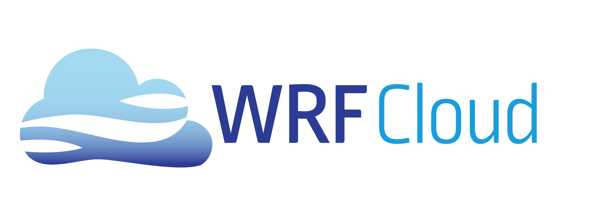

===========================
WRF Cloud version |version|
===========================
Developed by the `UCAR/UCP/COMET <https://www.comet.ucar.edu/>`_ and `UCAR/NCAR/RAL <https://ral.ucar.edu/>`_ and `UCAR/NCAR/MMM <https://mmm.ucar.edu/>`_
Boulder, CO

Welcome
-------
The WRF Cloud framework is the realization of a idea years in the making to leverage maturing cloud computing techonologies to make numerical weather predition more accessible and efficient. The cloud-based forecasting system is designed to easily facilitate cost-effective state-of-the-art numerical weather prediction system forecasts in communities that lack the large computational resources. 

Contact
-------
Please visit `www.wrfcloud.com <https://www.wrfcloud.com>`_ for more information about how to become a WRF Cloud user.

Acronyms
--------

* **MMM**  - Mesoscale and Microscale Meteorology Lab
* **NCAR**  - National Center for Atmospheric Research
* **RAL**   - Research Applications Laboratory
* **UCAR**  - University Corporation for Atmospheric Research
* **UCP**   - UCAR Community Programs
* **WRF**   - Weather Research and Forecasting Model

.. rubric:: Organization

.. toctree::
   :hidden:
   :caption: WRF Cloud

   Users_Guide/index

Index
=====

* :ref:`genindex`
